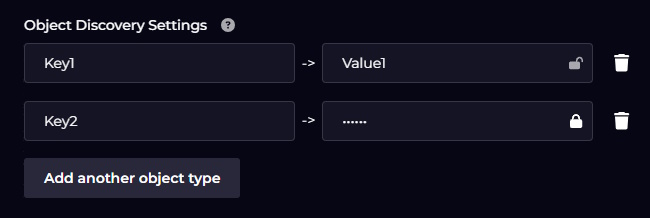

# Defining a Plugin's Configuration UI (`ui.json`)

Available field types (controls) are currently:

- [`text`](#text)
- [`password`](#password)
- [`number`](#number)
- [`autocomplete`](#autocomplete)
- [`radio`](#radio)
- [`checkbox`](#checkbox)
- [`fieldGroup`](#fieldgroup)
- [`key-value`](#key-value)

## The `pluginConfig` Object

This object generated by the platform when the user enters the details requested by the UI generated from `ui.json`. It is passed in to every run-time call on the plugin. A property is created on this object for each control defined in `ui.json` - the `name` property in `ui.json` defines the name of the property in `pluginConfig`.

## The Controls

### text
The `text` field allows the entry of text:

```json
    {
        "type": "text",
        "name": "serverUrl",
        "label": "Server URL",
        "title": "Server URL",
        "help": "The URL to use",
        "validation": {
            "required": true
         },
        "placeholder": "https://your.server.net/api/v1"
    },
```


### password
The `password` field type allows the entry of text, obscured opn screen and encrypted in the back-end:

```json
    {
        "type": "password",
        "name": "apiKey",
        "label": "API Key",
        "title": "API Key",
        "help": "Provide your API Key",
        "validation": {
            "required": true
        }
    },
```


### number
The `number` field type allows the entry of a numeric value.

```json
{
    "name": "fruitCount",
    "type": "number",
    "label": "Fruit Count",
    "title": "Fruit Count",
    "help": "Pick X items of your fruit choice.",
    "defaultValue": 100,
    "validation": { "required": false, "min": 1, "max": 1000 }
}
```


### autocomplete
The `autocomplete` field type takes the following format, in the following example for a fictional fruit-based plugin:

```json
{
  "type": "autocomplete",
  "name": "fruitChoice",
  "label": "Fruit Endpoint",
  "title": "Fruit Endpoint",
  "help": "Select your required fruit endpoint",
  "validation": { "required": true },
  "placeholder": "Fruit...",
  "isMulti": false,
  "data": {
    "source": "fixed",
    "values": [
      { "value":"https://api.apple.com", "label": "api.apple.com"},
      { "value":"https://api.banana.com", "label": "api.banana.com"}
    ]
  },
  "defaultValue": ""
}
```


The property for this control in `pluginConfig` is an array of objects, each with a `value` property containing the users selection.

### radio
The `radio` field type is similar:

```json
{
  "type": "radio",
  "name": "fruitType",
  "label": "Fruit type",
  "title": "Fruit type",
  "help": "Select 'Apple' or 'Banana'",
  "validation": { "required": true },
  "defaultValue": "apple",
  "options": [
    {
      "value": "apple",
      "label": "Apple",
      "description": "An apple!"
    },
    {
      "value":"banana",
      "label": "Banana",
      "description": "A banana!"
    }]
}
```


### checkbox
The `checkbox` field shows a checkbox:

```json
      {
        "type": "checkbox",
        "name": "advancedLabels",
        "label": "Advanced Options",
        "title": "Advanced Options",
        "help": "Configure custom object types",
        "defaultValue": false,
        "value": "show"
    },
```


### fieldGroup
The `fieldGroup` field groups a number of other controls together and, optionally, makes them conditionally visible:

```json
    {
        "type": "fieldGroup",
        "name": "advancedLabelsGroup",
        "label": "Advanced Options",
        "visible": {
            "advancedLabels": "show"
        },
        "fields": [
            { ... },
            { ... },
            { ... }
        ]
    }
```
More information about the syntax of the `visible` node can be found on the [Plugin Field Types](https://squaredup-eng.atlassian.net/wiki/spaces/PPD/pages/26922639097857/Plugin+Field+Types) page in Confluence.

There is no real visibility of the `fieldGroup` control in the UI. If it's conditionally visible and the condition is false, it's completely absent from the UI. If it's not conditionally visible, or the condition is true, the child controls appear in the UI just as they would if they were not in a `fieldGroup`.

There is no useful presence in the `pluginConfig` object for this field type.

### key-value
The `key-value` field allows the user to add an arbitrary number of key-value pairs:

```json
    {
        "type": "key-value",
        "name": "labelSetting",
        "label": "Object Discovery Settings",
        "title": "Object Discovery Settings",
        "help": "Enter the label setting for your object creation",
        "verb": "->",
        "displayName": "object type",
        "keyInput": {
            "title": "Object Type",
            "placeholder": "Server Cpu"
        },
        "valueInput": {
            "title": "Object Labels",
            "placeholder": "servername, cpu"
        }
    }

```



The property for this control in `pluginConfig` is an array of objects, each with `key` and `value` properties containing the users selection.